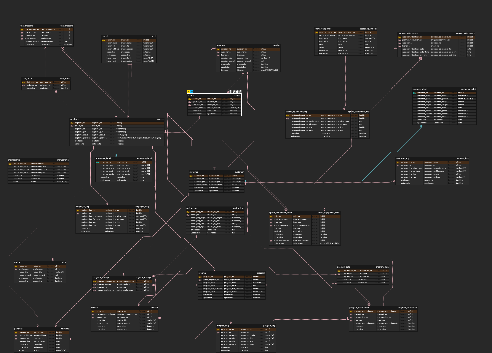

# GD HEALTH
>헬스클럽 운영/관리 플랫폼입니다.  
팀원들과 프로젝트 주제에 대해 상의 중에 헬스 프랜차이즈 지점별로
고객들을 관리하고 본사에서 총괄하는 웹사이트를 만들면 좋을 것 같다는 의견이 있어 회의를 거쳐 제작하였습니다.

역할 : 본사(Headoffice) 페이지, 채팅 

⌨️ **Demo Link** 
[직원 / 본사 로그인 페이지](http://52.78.98.70/employee/login) 
[고객 로그인 페이지](http://52.78.98.70/customer/login) 
 

## 📍 참여 인원 & 제작 기간
- 참여 인원 : 5명 
- 제작 기간 : 2023.12.21 — 2024.01.31
 

## 📍 사용 기술
Backend
>Java 17 
>Spring Boot 3.2.0 
>MariaDB 10.5.22 
>MyBatis
  
Frontend
>JavaScript(JQuery)
  
Tool
>Maven 
>Git 
>AWS

 

## 📍 ERD 설계

  

## 📍 담당 기능
- 공통 기능
  - 본사 페이지네이션(HeadofficePagination.java) 
  - 본사 페이지 파일 저장(HeadofficeImageSave.java) 
 

- 직원(본사)
  - 직원 추가
      - ID 중복 검사
      - Bean Validation API를 이용한 유효성 검사(정규식 이용)
  - 직원 목록
      - 검색 기능
      - Ajax로 페이지네이션 처리(검색 후 결과에 대해서도 적용)
 

- 회원(본사)
  - 회원 목록
    - 검색 기능
    - Ajax로 페이지네이션 처리(검색 후 결과에 대해서도 적용)
 

- 프로그램(본사)
    - 프로그램 추가
        - 달력 API를 이용해 개설 날짜 추가 가능
        - Bean Validation API를 이용한 유효성 검사
        - 개설 날짜들의 중복 검사
        - Custom Validator API로 프로그램 파일을 첨부하였는지 검증
        - Service Layer에서 첨부한 파일의 type이 이미지인지 검증
    - 프로그램 목록
        - 검색 기능
        - Ajax로 페이지네이션 처리(검색 후 결과에 대해서도 적용)
    - 프로그램 상세
        - 비활성화/활성화 버튼 클릭시 active 변경
    - 프로그램 수정
        - 이미지 파일 첨부시 Service Layer에서 첨부한 파일의 type이 이미지인지 검증
        - Custom Validator와 Bean Validation으로 서버 사이드에서 검증
 

- 물품(본사)
    - 물품 추가
        - Bean Validation API를 이용한 유효성 검사
        - Custom Validator API로 프로그램 파일을 첨부하였는지 검증
    - 물품 목록
        - 검색 기능
        - Ajax로 페이지네이션 처리(검색 후 결과에 대해서도 적용)
        - 비동기 통신으로 활성화/비활성화 버튼 구현
    - 물품 수정
        - 이미지 파일 첨부시 Service Layer에서 첨부한 파일의 type이 이미지인지 검증
 

- 채팅(본사)
    - 채팅방 목록
        - 채팅으로 문의한 고객들의 채팅방 조회 가능
        - 각각의 고객에 대한 채팅 방을 구분하고 특정한 고객과 1대1로만 채팅을 할 수 있게 구현
    - 채팅방
        - 각각의 고객의 방으로 입장하면 고객과 본사 직원이 보낸 이전 채팅 기록을 확인 가능
        - 고객과 실시간으로 채팅이 가능하도록 구현
 

- 채팅(고객)
    - 채팅방
        - 처음으로 채팅 방에 입장한다면 DB에 방에 대한 정보 추가
        - 고객과 본사 직원이 보낸 이전 채팅 기록을 확인 가능
        - 본사 직원과 실시간으로 채팅이 가능하도록 구현
 

## 📍 문제 / 해결
1. 
   - 문제 : 프로그램을 추가할 때 파일이 추가되었는지 검증을 해야 하는데 스프링이 제공하는 validation API로는 MultipartFile type 검증이 어려웠습니다.
   - 해결 : Custom Validator API를 만들어 프로그램 파일을 첨부하였는지 검증하였습니다.
 

2. 
   - 문제 : 한 번에 DB의 program_date table에 여러 개의 프로그램 날짜들을 추가하려고 할 때  Service Layer에서 프로그램 날짜 1개를 추가할 때마다 insert 작업을 한 번 하려고 하였으나 DB 성능 저하가 우려되었습니다.
   - 해결 : ProgramMapper.xml에서 foreach문을 사용하여 List&lt;VO&gt; type으로 한 번의 insert 작업으로 여러 개의 프로그램 날짜들을 추가하였습니다.
 

3. 
    - 문제 : 프로그램을 추가할 때 날짜의 형식과 오늘 이후의 날짜인지에 대한 검증을 해야 하는데 스프링이 제공하는 validation API로는 List 내의 각각의 요소에 대해서 검증하기 어려웠습니다.
    - 해결 : Custom Validator API를 만들어 List type에 대해 validation을 하여 선택한 프로그램 날짜들의 형식이 올바른지, 오늘 이후의 날짜인지 검증하였습니다. 
 

4. 
    - 문제 : 채팅 방에서 로그인된 고객을 특정해야 하는데 WebSocketSession 객체로는 각각의 고객에 대해 특정하기 어려웠습니다.
    - 해결 : HttpSessionHandshakeInterceptor을 이용하여 WebSocketHandler가 실행되기 전에 저장된 고객의 세센 값을 가져 와서 고객을 특정하는 것이 가능해졌습니다.

