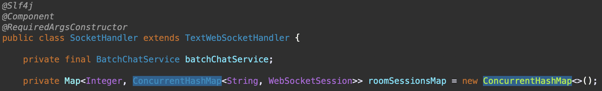

# GD HEALTH

>헬스클럽 운영/관리 플랫폼입니다.  
팀원들과 프로젝트 주제에 대해 상의하던 중, 헬스 프랜차이즈 지점별로 고객들을 관리하고 본사에서 총괄하는
웹사이트를 만들면 좋을 것 같다는 의견이 있어 회의를 거쳐 제작하였습니다.

⌨️ **Demo Link** 
[로그인 페이지](http://52.78.98.70) 
 

## 📍 역할
본사(Headoffice) 페이지, 채팅 
 

## 📍 참여 인원 & 제작 기간
- 참여 인원 : 5명 
- 제작 기간 : 2023.12.21 — 2024.01.31
  
 

## 📍 사용 기술
Backend
>Java 17 
>Spring Boot 3.2.0 
>MariaDB 10.5.22 
>MyBatis
  
Frontend
>JavaScript(JQuery)
  
Tool
>Maven 
>Git 
>AWS

 

## 📍 담당 기능
- 공통 기능
  - 본사 페이지네이션 [📌 코드 확인](https://github.com/kwanho12/GDHealth/blob/develop/src/main/java/com/tree/gdhealth/utils/pagination/HeadofficePagination.java) 
  - 본사 페이지 파일 저장 [📌 코드 확인](https://github.com/kwanho12/GDHealth/blob/develop/src/main/java/com/tree/gdhealth/utils/imagesave/HeadofficeImageSaver.java)
  

- 직원(본사) [📌 코드 확인](https://github.com/kwanho12/GDHealth/tree/develop/src/main/java/com/tree/gdhealth/headoffice/emp)
  - 직원 추가
      - ID 중복 검사
      - Bean Validation API를 이용한 유효성 검사(정규식 이용)
  - 직원 목록
      - 검색 기능
      - Ajax로 페이지네이션 처리(검색 후 결과에 대해서도 적용)
  

- 회원(본사) [📌 코드 확인](https://github.com/kwanho12/GDHealth/tree/develop/src/main/java/com/tree/gdhealth/headoffice/customer)
  - 회원 목록
    - 검색 기능
    - Ajax로 페이지네이션 처리(검색 후 결과에 대해서도 적용)
  

- 프로그램(본사) [📌 코드 확인](https://github.com/kwanho12/GDHealth/tree/develop/src/main/java/com/tree/gdhealth/headoffice/program)
    - 프로그램 추가
        - 달력 API를 이용해 개설 날짜 추가 가능
        - Bean Validation API를 이용한 유효성 검사
        - 개설 날짜들의 중복 검사
        - Custom Validator API로 프로그램 파일을 첨부하였는지 검증
        - Service Layer에서 첨부한 파일의 type이 이미지인지 검증
    - 프로그램 목록
        - 검색 기능
        - Ajax로 페이지네이션 처리(검색 후 결과에 대해서도 적용)
    - 프로그램 상세
        - 비활성화/활성화 버튼 클릭시 active 변경
    - 프로그램 수정
        - 이미지 파일 첨부시 Service Layer에서 첨부한 파일의 type이 이미지인지 검증
        - Custom Validator와 Bean Validation으로 서버 사이드에서 검증
  

- 물품(본사) [📌 코드 확인](https://github.com/kwanho12/GDHealth/tree/develop/src/main/java/com/tree/gdhealth/headoffice/sportsEquipment)
    - 물품 추가
        - Bean Validation API를 이용한 유효성 검사
        - Custom Validator API로 프로그램 파일을 첨부하였는지 검증
    - 물품 목록
        - 검색 기능
        - Ajax로 페이지네이션 처리(검색 후 결과에 대해서도 적용)
        - 비동기 통신으로 활성화/비활성화 버튼 구현
    - 물품 수정
        - 이미지 파일 첨부시 Service Layer에서 첨부한 파일의 type이 이미지인지 검증
  

- 채팅(본사) [📌 코드 확인](https://github.com/kwanho12/GDHealth/tree/develop/src/main/java/com/tree/gdhealth/headoffice/chat)
    - 채팅방 목록
        - 채팅으로 문의한 고객들의 채팅방 조회 가능
        - 각각의 고객에 대한 채팅 방을 구분하고 특정한 고객과 1대1로만 채팅을 할 수 있게 구현
    - 채팅방
        - 웹소켓으로 채팅 기능 구현
        - 각각의 고객의 방으로 입장하면 고객과 본사 직원이 보낸 이전 채팅 기록을 확인 가능
        - 고객과 실시간으로 채팅이 가능하도록 구현
  

- 채팅(고객) [📌 코드 확인](https://github.com/kwanho12/GDHealth/tree/develop/src/main/java/com/tree/gdhealth/customer/chat)
    - 채팅방
        - 웹소켓으로 채팅 기능 구현
        - 처음으로 채팅 방에 입장한다면 DB에 방에 대한 정보 추가
        - 고객과 본사 직원이 보낸 이전 채팅 기록을 확인 가능
        - 본사 직원과 실시간으로 채팅이 가능하도록 구현
  

## 📍 개선 사항
   - 프로그램을 추가할 때 날짜의 형식과 오늘 이후의 날짜인지에 대한 검증해야 하는데 스프링이 제공하는 기본 validation API로는 List 내의 각각의 요소에 대해서 검증하기 어려웠습니다. 
    → Custom Validator API를 만들어 List type에 대해 validation을 하여 선택한 프로그램 날짜들의 형식이 올바른지, 오늘 이후의 날짜인지 검증하였습니다. [📌 코드 확인](https://github.com/kwanho12/GDHealth/blob/develop/src/main/java/com/tree/gdhealth/utils/customvalidation/ListPattern.java)
      

   - SocketHandler에서 채팅방 번호와 session에 대한 정보를 저장하는 roomSessionMap 변수는 여러 스레드에서 공유되는 자원이므로 여러 사용자의 웹 소켓 세션들이 동시에 읽고 쓰려고 할 때 동시성 문제가 발생할 수 있습니다. 
    
    → roomSessionMap의 객체를 HashMap에서 동시성을 위해 설계된 컬렉션인 ConcurrentHashMap으로 변경하였습니다. 
    
      

   - 한 번에 DB의 program_date table에 여러 개의 프로그램 날짜들을 추가하려고 할 때 Service Layer에서 프로그램 날짜 1개를 추가할 때마다 insert 작업을 한 번 하려고 하였으나 DB 성능 저하가 우려되었습니다.
     
    → ProgramMapper.xml에서 for each문을 사용하여 List&lt;Domain&gt; type으로 한 번의 insert 작업으로 여러 개의 프로그램 날짜들을 추가하였습니다. [📌 코드 확인](https://github.com/kwanho12/GDHealth/blob/develop/src/main/java/com/tree/gdhealth/headoffice/program/ProgramMapper.xml#L144)

 

## 📍 회고
- 채팅 기능을 구현할 때 채팅 메시지들을 DB에 저장하는 방식에 대해 고민했었습니다. 데이터베이스의 성능 저하를 고려하여 메시지를 일정 시간 동안 메모리에 버퍼링한 후 일괄적으로 데이터베이스에 저장하는 배치 저장과 응답 시간을 줄이기 위해 Thread Pool을 활용하는 비동기 처리 방식에 대해 생각해 보았습니다.

- 배치 저장의 경우 메시지가 일괄적으로 데이터베이스에 저장되기 전에 채팅 페이지에서 새로운 요청을 하면 이전의 채팅 기록이 보이지 않을 수 있고 Thread Pool을 활용하는 비동기 처리 방식(@Async)의 경우 메시지가  데이터베이스에 저장되는 순서가 보장되지 않아 정합성을 해칠 수 있다는 문제점이 있어 원래의 방식인 메시지를 전송할 때마다 실시간으로 데이터베이스에 저장하는 방법을 택했습니다.

- 팀원들과 프로젝트를 진행할 당시에는 러닝 커브로 인해 학원에서 배운 기술만 사용하였기 때문에 고려 대상이 아니었지만, 이후에 채팅 메시지는 메모리 기반의 빠른 읽기 및 쓰기 속도를 제공하고 상대적으로 I/O 비용이 적은 Redis에 저장하는 방식으로 변경하여 채팅 메시지를 데이터베이스에 저장하는 성능을 최적화할 예정입니다.

- 팀원들의 파트 분배, 템플릿 선정에 대해 저와 다른 의견을 가진 팀원들이 있었는데 이에 대하여 팀원을 설득도 해 보고 팀원의 의견에 동조하여 따르기도 하면서 팀 프로젝트의 의의에 대해 상기하였습니다. 현업에서 일하게 된다면 팀 프로젝트로 진행하는 경우가 많을 것이므로 이러한 경험들이 나중에 도움이 될 수 있을 거라고 생각하였습니다.

